# sci-plot


```r
library(ggplot2)
library(gridExtra) # function: grid.arrange
library(grid)     # function: viewport
```

# 1. 柱状图


```r
specie <- c(rep("sorgho" , 3) , rep("poacee" ,3) , rep("banana" , 3) , rep("triticum" , 3) )
condition <- rep(c("normal" , "stress" ,"Nitrogen") , 4)
value <- abs(rnorm(12 , 0 , 15))
dat1 <- data.frame(specie,condition,value)
dat1
```

```
##      specie condition     value
## 1    sorgho    normal  8.755977
## 2    sorgho    stress  3.701547
## 3    sorgho  Nitrogen  6.600339
## 4    poacee    normal 45.514477
## 5    poacee    stress 20.811739
## 6    poacee  Nitrogen  9.946512
## 7    banana    normal  3.054354
## 8    banana    stress  2.099968
## 9    banana  Nitrogen  1.499929
## 10 triticum    normal 37.665951
## 11 triticum    stress  7.485610
## 12 triticum  Nitrogen  7.479551
```

在绘图的时候把specie映射给x，value映射给y，condition映射给颜色属性。并且设置坐标轴标题字体16，坐标轴标签字体14，图片的title字体为20. 

## 1.1 填充式需要设定几何对象geom_bar()的参数position="fill"（堆叠数据，百分比展示）


```r
ggplot(dat1, aes(x=specie, y=value, fill=condition)) +
    geom_bar(stat="identity", position="fill") + 
    theme_bw() +
    labs(x = "Specie", y = "Value", title = "This is barplot") + 
    theme(axis.title =element_text(size = 16), 
          axis.text =element_text(size = 14, color = "black"),
          plot.title =element_text(hjust = 0.5, size = 20))
```

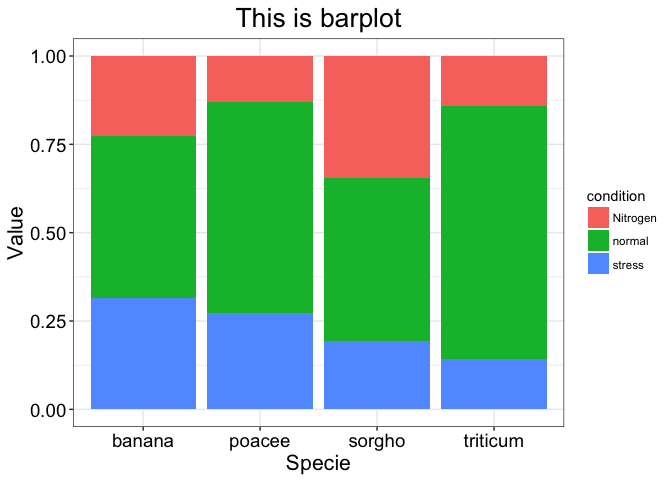<!-- -->

## 1.2 堆积式需要设定几何对象geom_bar()的参数position = "stack"（堆叠数据，非百分比展示）


```r
ggplot(dat1, aes(x=specie, y=value, fill=condition)) +
    geom_bar(stat="identity", position="stack") + 
    theme_bw() +
    labs(x = "Specie", y = "Value", title = "This is barplot") + 
    theme(axis.title =element_text(size = 16), 
          axis.text =element_text(size = 14, color = "black"),
          plot.title =element_text(hjust = 0.5, size = 20))
```

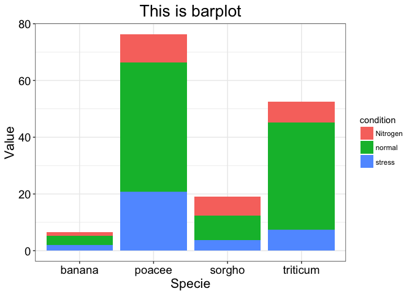<!-- -->

## 1.3 并列式需要设定几何对象geom_bar()的参数position= "dodge"（并列数据，非百分比展示）


```r
ggplot(dat1, aes(x=specie, y=value, fill=condition)) +
    geom_bar(stat="identity", position="dodge") + 
    theme_bw() +
    labs(x = "Specie", y = "Value", title = "This is barplot") + 
    theme(axis.title =element_text(size = 16), 
          axis.text =element_text(size = 14, color = "black"),
          plot.title =element_text(hjust = 0.5, size = 20))
```

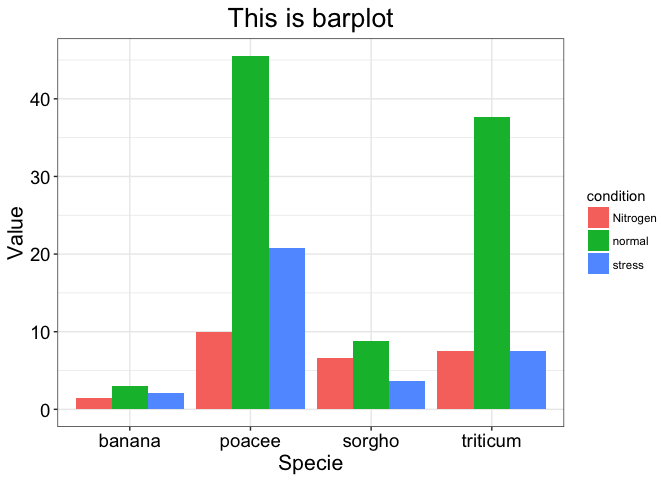<!-- -->

# 2. 散点图 Scatter diagram


```r
data(faithful)
faithful$group <-ifelse(faithful$eruptions > 3, "A", "B")
head(faithful)
```

```
##   eruptions waiting group
## 1     3.600      79     A
## 2     1.800      54     B
## 3     3.333      74     A
## 4     2.283      62     B
## 5     4.533      85     A
## 6     2.883      55     B
```

## 2.1 基本散点图


```r
ggplot(faithful, aes(x=waiting, y=eruptions, col = group)) + 
    geom_point()
```

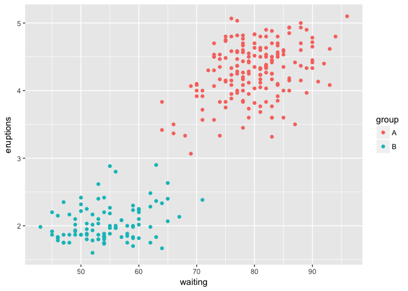<!-- -->

## 2.2 加上统计变换geom_smooth()，拟合的方法设定为loess回归


```r
ggplot(faithful, aes(x=waiting, y=eruptions, col = group)) + 
    geom_point() + 
    geom_smooth(aes(col =NULL), method ="loess") +
    theme_bw() +
    theme(axis.title = element_text(size = 20),
          axis.text = element_text(size = 18, color = "black"))
```

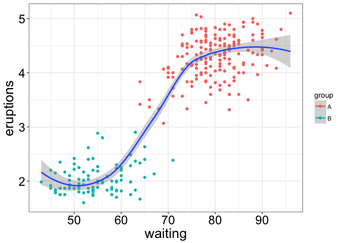<!-- -->

## 2.3 添加confidence ellipses


```r
ggplot(faithful, aes(x=waiting, y=eruptions, col = group)) + 
    geom_point() + 
    geom_smooth(aes(col =NULL), method ="loess") +
    stat_ellipse() +
    theme_bw() +
    theme(axis.title = element_text(size = 20),
          axis.text = element_text(size = 18, color = "black"))
```

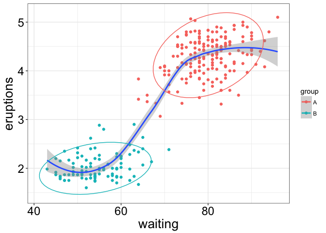<!-- -->

# 3. 箱形图 Boxplot

箱形图由五个数值点构成：最小值(Min)，下四分位数(Q1)，中位数(median)，上四分位数(Q3)，最大值(Max)。上四分位数到最大值之间建立一条延伸线，这个延伸线成为“胡须(whisker)”。

- IQR = Q3 - Q1，即上四分位数与下四分位数之间的差，也就是盒子的长度
- 最小观测值为Min = Q1 - 1.5 * IQR，如果存在离群点小于最小观测值，则胡须下限为最小观测值，离群点单独以点汇出。如果没有比最小观测值小的数，则胡须下限为最小值。
- 最大观测值为Max = Q3 - 1.5 * IQR，如果存在离群点大于最大观测值，则胡须上限为最大观测值，离群点单独以点汇出。如果没有比最大观测值大的数，则胡须上限为最大值。


```r
data(mpg)
head(mpg[c("class","hwy")])
```

```
## # A tibble: 6 x 2
##     class   hwy
##     <chr> <int>
## 1 compact    29
## 2 compact    29
## 3 compact    31
## 4 compact    30
## 5 compact    26
## 6 compact    26
```

## 3.1 基本箱形图


```r
ggplot(mpg, aes(x=class, y=hwy, fill =class)) + 
    geom_boxplot() + 
    theme_bw() + 
    theme(axis.title = element_text(size = 20), 
          axis.text = element_text(size = 16, color = "black"), 
          legend.position = "none")
```

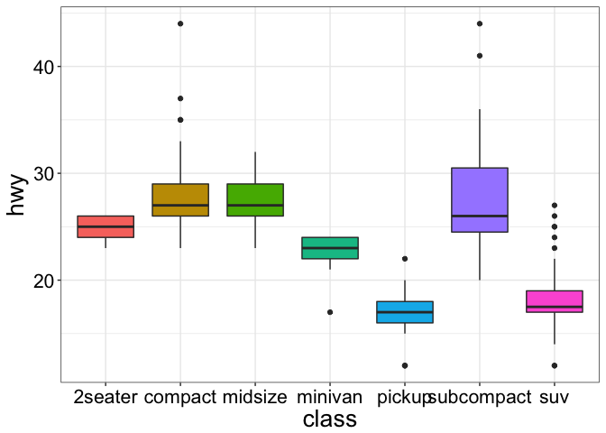<!-- -->

## 3.2 添加扰动点geom_jitter()，并且翻转坐标轴coord_flip()


```r
ggplot(mpg, aes(x=class, y=hwy, fill =class)) + 
    geom_boxplot(notch = TRUE) + 
    theme_bw() + 
    geom_jitter(width = 0.2) + 
    theme(axis.title = element_text(size = 20), 
          axis.text = element_text(size = 16, color = "black"), 
          legend.position = "none") +
    coord_flip()
```

```
## notch went outside hinges. Try setting notch=FALSE.
## notch went outside hinges. Try setting notch=FALSE.
```

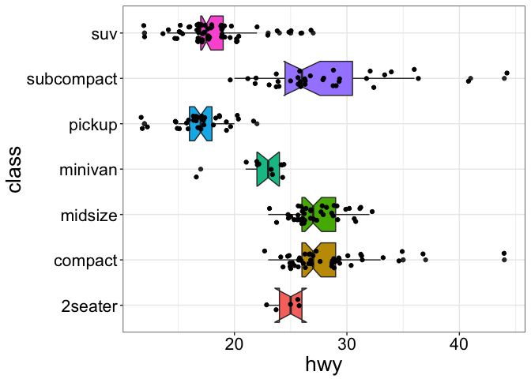<!-- -->

# 4. 维恩图 Venn Diagram


```r
library(gplots)
```


```r
## construct some fake gene names..
oneName <- function() paste(sample(LETTERS, 5, replace = TRUE), collapse = "")
geneNames <- replicate(1000, oneName())

##
GroupA <- sample(geneNames, 400, replace = FALSE)
GroupB <- sample(geneNames, 750, replace = FALSE)
GroupC <- sample(geneNames, 250, replace = FALSE)
GroupD <- sample(geneNames, 300, replace = FALSE)
input <- list(GA = GroupA, GB = GroupB, GC = GroupC, GD = GroupD)
venn(input)
```

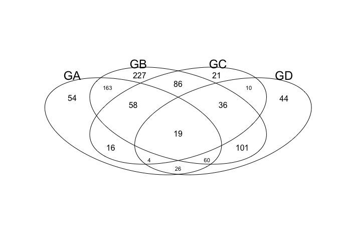<!-- -->

# 4. ggplot一页多图绘制之gridExtra


```r
p1 <- ggplot(iris, aes(Species, Sepal.Width, fill = Species)) +
    geom_boxplot() +
    ggtitle("This is first plot") +
    theme(axis.title = element_text(size = 14),
          axis.text = element_text(size = 12),
          plot.title = element_text(hjust = 0.5))
 
p2 <- ggplot(iris, aes(Species, Sepal.Width, fill = Species)) +
    geom_boxplot() +
    theme_bw() +
    ggtitle("This is second plot") +
    theme(axis.title = element_text(size = 14),
          axis.text = element_text(size = 12),
          plot.title = element_text(hjust = 0.5))
 
 
p3 <- ggplot(iris, aes(Sepal.Length, Sepal.Width, col = Species, shape = Species)) +
    geom_point() +
    ggtitle("This is third plot") +
    theme(axis.title = element_text(size = 14),
          axis.text = element_text(size = 12),
          plot.title = element_text(hjust = 0.5))
 
p4 <- ggplot(iris, aes(Sepal.Length, Sepal.Width, col = Species, shape = Species)) +
    geom_point() +
    theme_bw() +
    ggtitle("This is fourth plot") +
    theme(axis.title = element_text(size = 14),
          axis.text = element_text(size = 12),
          plot.title = element_text(hjust = 0.5))

grid.arrange(p1, p2, p3, p4, ncol = 2, nrow = 2)
```

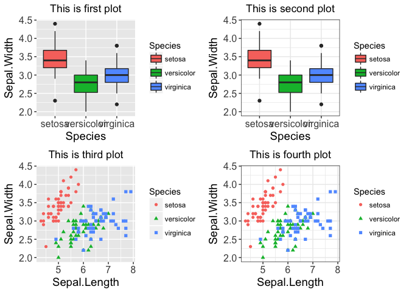<!-- -->

# 5. 子母图绘制工具--viewport


```r
p5 <- ggplot(iris, aes(Sepal.Length, Sepal.Width, col = Species, shape = Species)) +
    geom_point(size = 2) +
    theme_bw() +
    ggtitle("This is main plot") +
    xlim(4, 10) +
    theme(axis.title = element_text(size = 16),
          axis.text = element_text(size = 14),
          plot.title = element_text(hjust = 0.5),
          legend.position = "none")
p6 <- ggplot(iris, aes(Species, Sepal.Width, fill = Species)) +
    geom_boxplot() +
    theme_bw() +
    ggtitle("This is submain plot") +
    theme(axis.title = element_blank(),
          axis.text = element_text(size = 8),
          plot.title = element_text(hjust = 0.5),
          legend.position = "none")

# viewport主要的参数有4个，x和y设置中心位点相对于父图层的位置，width和height设置子图形的大小
subvp <- viewport(x = 0.83, y = 0.75, width = 0.3, height = 0.3)
p5
print(p6, vp = subvp)
```

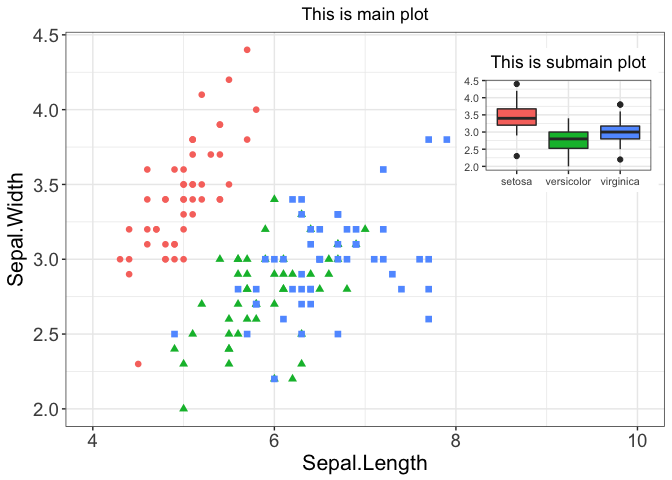<!-- -->


